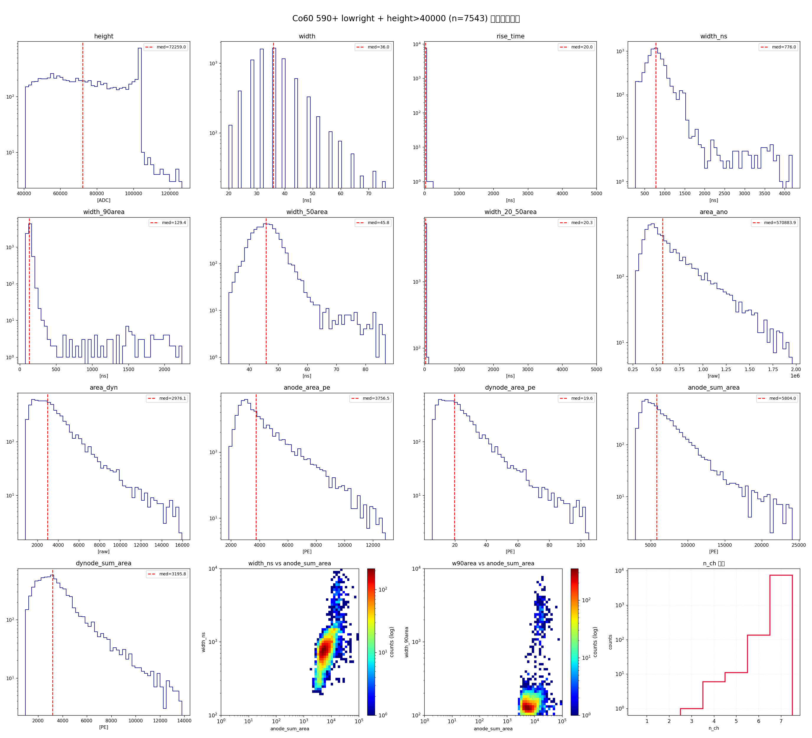
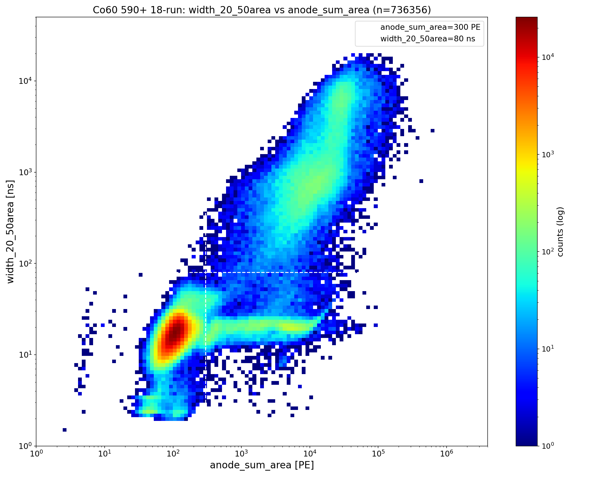
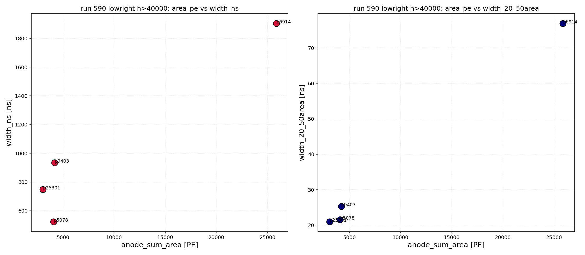

# Co60 590+ Runlist：lowright 区域与高能事例分析

> 数据源：`docs/run7_xe_calibration_run_590_plus.csv`（run 00590-00607，18 个 run，各 3600 s）
> 处理流程：read → match（dynode_shift=-16）→ cluster（100 ns）→ peak level（sum 波形基准参数）
> 总采集时长：18 × 3600 s = **64,800 s = 18.00 h**
> 总 peak 数：**736,356**

---

## 1. 筛选定义（cut 链）

在 `width_20_50area vs anode_sum_area` 二维图上划分区块：

| 区块 | 定义 |
|---|---|
| **lowright** | `width_20_50area < 80 ns` ∧ `anode_sum_area > 300 PE` |
| upright | `width_20_50area > 80 ns` ∧ `anode_sum_area > 300 PE` |

**lowright 区域参数范围（22,994 事例）：**

| 参数 | min | max | median | q99 |
|---|---|---|---|---|
| `anode_sum_area` [PE] | 300.1 | **97,876.6** | 2,114.9 | 17,714 |
| `width_20_50area` [ns] | 2.13 | **79.97** | 20.77 | 73.51 |

---

## 2. height > 40000 的事例

| 范围 | 数量 |
|---|---|
| **lowright 内 height > 40000** | **7,543** |
| 全部 peaks 中 height > 40000 | 17,089 |

**lowright 内 height > 40000 的通道数分布：**

| n_ch | 数量 | 占比 |
|---|---|---|
| **7** | **7,389** | **98.0%** |
| 6 | 136 | 1.8% |
| 5 | 11 | 0.15% |
| 4 | 6 | 0.08% |
| 3 | 1 | 0.01% |

> 高能 lowright 事例几乎全部为 **7-PMT 全符合**。

---

## 3. lowright + height > 40000 的参数分布（n=7,543）

### 参数中位

| 参数 | 中位 |
|---|---|
| height [ADC] | 72,259 |
| width [ns] | 36 |
| rise_time [ns] | 20 |
| width_ns [ns] | 776 |
| width_90area [ns] | 129.5 |
| width_50area [ns] | 45.8 |
| width_20_50area [ns] | 20.3 |
| area_ano | 570,884 |
| **area_dyn** | **2,976** |
| anode_area_pe [PE] | 3,756 |
| dynode_area_pe [PE] | 19.6 |
| anode_sum_area [PE] | 5,804 |
| dynode_sum_area [PE] | 3,196 |

### 分布图

**特征**：
- 98% 为 7 通道符合
- **dynode 信号有效**（`area_dyn` 2,976、`dynode_sum_area` 3,196 PE 非零）——与低能单通道事例（dynode 无信号）形成鲜明对比
- 脉冲较窄（width_ns 中位 776 ns、w20-50area 20.3 ns）

---

## 4. 二维分布（全 18 run）

---

## 5. run 00590 单 run 高能 lowright（height > 40000）

run 00590 单独只有 **4 个** 事例（低能早期 run），说明高能 lowright 事例**跨 run 分布不均**。

| peaks_id | height | width_ns | width_20_50area | anode_sum_area [PE] | n_ch |
|---|---|---|---|---|---|
| 5078 | 52,490 | 524 | 21.6 | 4,082 | 6 |
| 6914 | 67,502 | 1,904 | 76.9 | 25,858 | 5 |
| 9403 | 40,383 | 936 | 25.3 | 4,194 | 6 |
| 25301 | 41,789 | 748 | 21.0 | 3,044 | 6 |

逐事例 anode_sum/dynode_sum 波形见
`/mnt/data/tmp/muon_analysis/co60_590/peak_level/run_00590_lowright_h40000_waveforms/`。

---

## 6. 信号鉴别与事例率（Co 590+，18 h）

peak level 后按 `signal_id` 判据标记信号类型：

| 信号类型 | 判据 | 事例数 | 率 |
|---|---|---|---|
| **muon_s1** | n_ch=7 ∧ w20-50area<80ns ∧ anode_sum>300PE ∧ height≥4000 ∧ w90area<500ns | 7,506 | 417 /h |
| **muon_s2** | n_ch=7 ∧ w20-50area>80ns ∧ anode_sum>300PE | 9,434 | 524 /h |
| **超宽 S2** | upright_n7 中 n_samples_gt1000adc ≥ 2000 | 2,167 | 120 /h |

> 说明：`n_samples_gt1000adc` = anode_sum 波形中幅度 |值| > 1000 ADC 的样本数。

---

## 7. 结论

1. **lowright 区域**（窄脉冲 + 中高能量）参数范围：`anode_sum_area ∈ [300, 97,877] PE`、`width_20_50area ∈ [2.1, 80.0] ns`。
2. **height > 40000 的 lowright 事例 7,543 个**，其中 **98% 是 7 通道符合**——高能 lowright 本质是 7-PMT 全符合事例。
3. 这些事例 **dynode 侧有有效信号**（area_dyn 非零），区别于低能单通道事例（dynode 无信号）。
4. **run 590 单独仅 4 个**高能 lowright，跨 run 分布不均。
