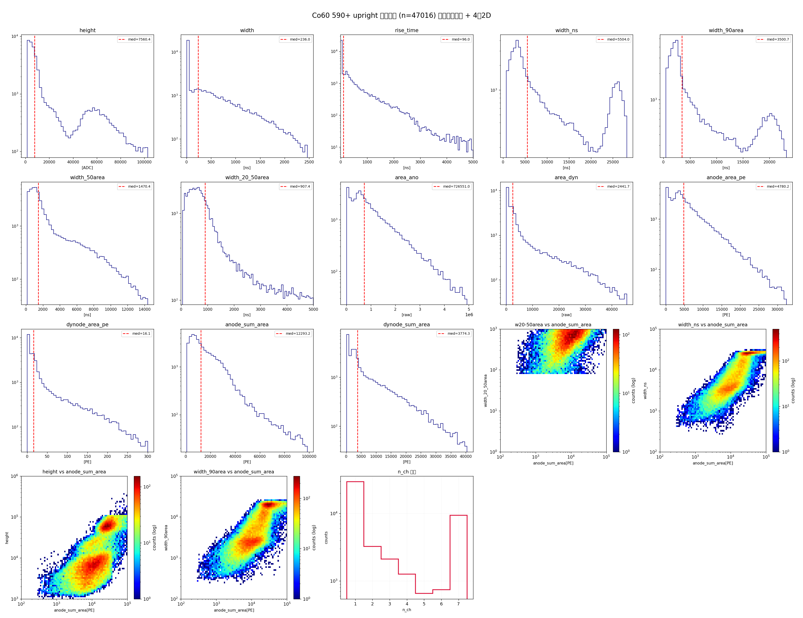

# Co60 590+ upright 区域分析（全部参数分布 + n_ch 占比）

> 数据源：`docs/run7_xe_calibration_run_590_plus.csv`（run 00590-00607，18 个 run，各 3600 s）
> 总采集时长：**64,800 s = 18.00 h**
> 处理流程：read → match（dynode_shift=-16）→ cluster（100 ns）→ peak level

---

## 1. 定义与数量

| 区块 | 定义 | 数量 |
|---|---|---|
| **upright** | `width_20_50area > 80 ns` ∧ `anode_sum_area > 300 PE` | **47,016** |

事例率（18 h）：**2,612 /h** = 43.53 /min = 0.7256 /s

---

## 2. n_ch 占比（upright 全部事例）

| n_ch | 数量 | 占比 |
|---|---|---|
| **1** | **29,554** | **62.86%** |
| 2 | 3,247 | 6.91% |
| 3 | 2,113 | 4.49% |
| 4 | 1,266 | 2.69% |
| 5 | 656 | 1.40% |
| 6 | 746 | 1.59% |
| **7** | **9,434** | **20.07%** |
| **合计** | **47,016** | 100% |

**观察**：
- **单通道（n_ch=1）占 62.86%**——主导成分
- **7 通道（全部 PMT 触发）占 20.07%**（9,434 个）——第二大成分，即 `muon_s2`
- 中间通道数（2-6）合计 17.07%

---

## 3. 全部参数分布

图含：
- **13 个 1D 参数分布**（y-log）：height / width / rise_time / width_ns / width_90area / width_50area / width_20_50area / area_ano / area_dyn / anode_area_pe / dynode_area_pe / anode_sum_area / dynode_sum_area
- **4 个 2D 分布**（jet, log 轴）：
  - `width_20_50area vs anode_sum_area`
  - `width_ns vs anode_sum_area`
  - `height vs anode_sum_area`
  - `width_90area vs anode_sum_area`
- **n_ch 分布**

---

## 4. 与其它区块对比（Co 590+，18 h）

| 区块 | 定义 | 数量 | 率 |
|---|---|---|---|
| **upright** | w20-50>80ns ∧ anode_sum>300 | 47,016 | 2,612 /h |
| lowright | w20-50<80ns ∧ anode_sum>300 | 22,994 | 1,277 /h |
| upright + n_ch=7（muon_s2）| + n_ch=7 | 9,434 | 524 /h |
| lowright + n_ch=7（muon_s1）| + n_ch=7 + 4 cuts | 7,506 | 417 /h |

---

## 5. 结论

1. **upright 全部 47,016 事例**，率 2,612 /h。
2. **n_ch 占比**：单通道 62.86%、7 通道 20.07%、2-6 通道 17.07%。
3. 7 通道（全 PMT 触发）的 9,434 个即 **muon_s2**（宽脉冲信号），是 upright 中最重要的物理子集。
4. 4 个 2D 图展示了 upright 事例的宽度/高度与阳极面积的关系，可用于进一步筛选标定。
