# Muon 分析算法架构（Pipeline 逐步图解）

> 本文档按数据处理 Pipeline 的**关键步骤**组织，每一步给出算法说明、关键参数与
> 对应的**数据验证图片**（No-Field / 00183 实测）。
>
> 配套：[架构总览](muon_analysis_architecture.md) / [需求](muon_dynode_analysis_requirements.md) /
> [实施计划](muon_dynode_analysis_implementation_plan.md) / [批量结果](muon_batch_selection_report.md)

---

## Pipeline 总览

```
runinfo 发现 → 读取波形 → 时间匹配(anode↔dynode) → 聚类成 peak → 逐通道特征/PE
    → sum 波形(anode_sum/dynode_sum) → peak 级参数(sum 基准) → 筛选(muon 候选)
    → COG 位置 → 三维径迹 → 输出(CSV/npz/PNG)
```

| 步骤 | 模块 | 产物 |
|---|---|---|
| 1 | `io/runinfo.py` + `io/readers*` | RunData（board 分离 anode=0/dynode=1）|
| 2 | `matching.py` | 匹配对（dt 分布）|
| 3 | `clustering.py` | Peak（多 anode + 多 dynode）|
| 4 | `features.py` | 逐通道 Features + PE |
| 5 | `features.py` `compute_peak_summed_waveforms` | anode_sum / dynode_sum |
| 6 | `features.py` `compute_peak_features` | peak 级参数（height/width/rise_time/面积/PE）|
| 7 | `filtering.py` | MuonCandidate |
| 8 | `cog.py` / `track.py` | cog_x/cog_y / 三维径迹 |

---

## 步骤 1：时间匹配（matching）

**算法**：dynode 全局时间迁移 `+dynode_shift_ns`（No-Field 实测原始 dynode−anode
dt 中位数 ≈16ns → 移位后 dt∈[0,40ns]），按 **channel** 用 `merge_asof(backward)`
最近匹配。

**关键参数**：`matching.dynode_shift_ns=16`（00183 为 4ns）、`sample_interval_ns=4`、
匹配窗口 dt∈[0,40ns]。

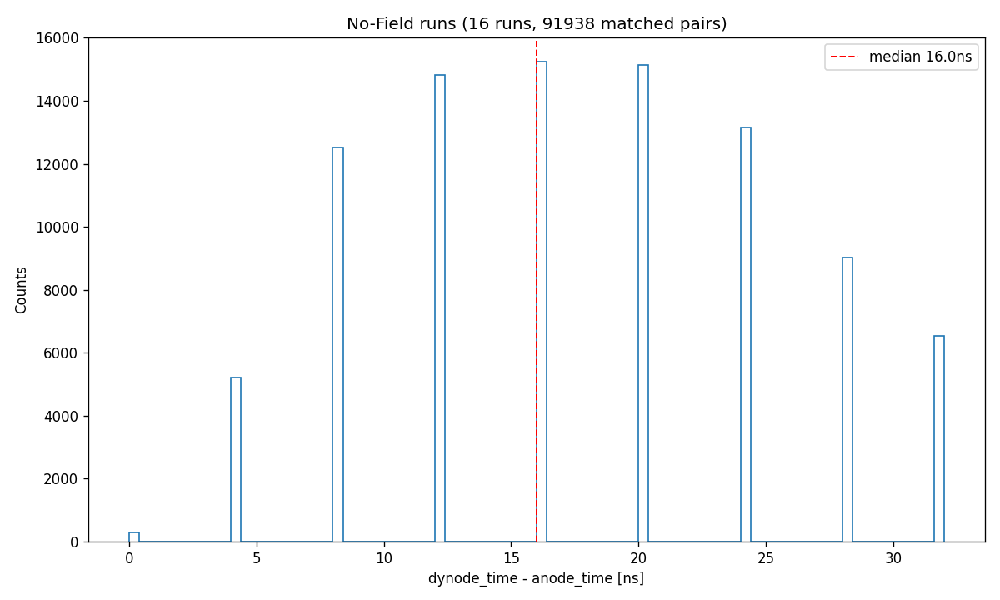

> No-Field 匹配后 dt 峰值位于 0-40ns 窗口内，主峰 ~16ns 迁移后归零，证实移位参数正确。

---

## 步骤 2：匹配后波形对比（逐对）

**算法**：匹配对（同一 channel、同一事件的 anode 与 dynode 波形）按时间对齐后
叠加对比；`rawdyn` 版本为 dynode 原始波形（无 ×230 放大），用于核对形状关系。

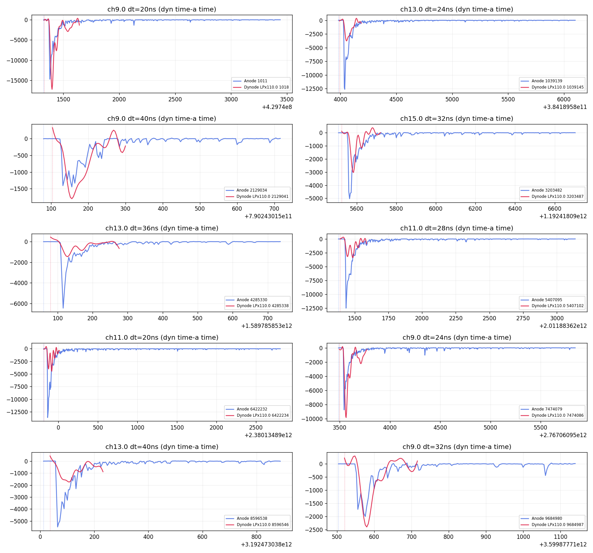

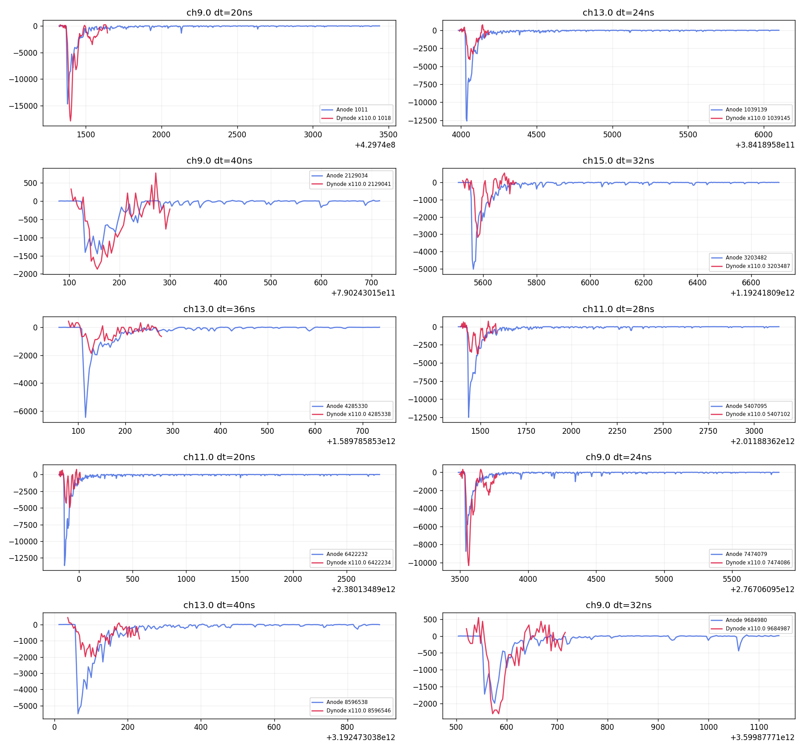

---

## 步骤 3：聚类成 peak（clustering）

**算法**：100ns 时间窗口内聚合匹配对 → `Peak`（同一事例的多 anode + 多 dynode
record）。窗口参数：`clustering.window_ns=100`。

**聚类结果示例**（本次新算法，No-Field run 00401）：聚类得到的 peak 级
anode_sum / dynode_sum 波形对比：

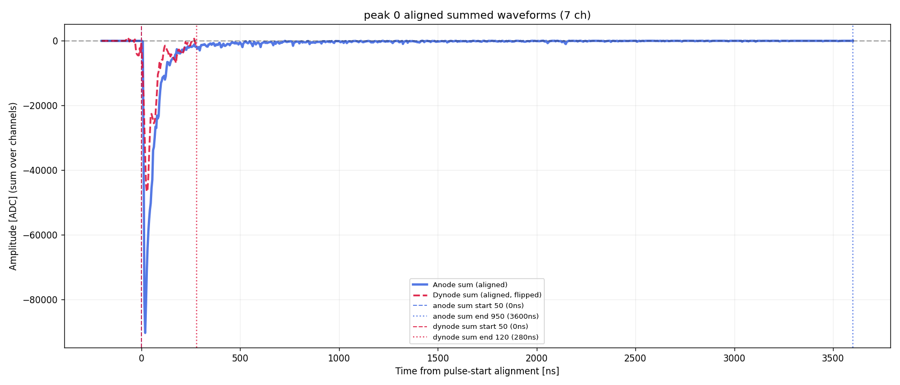

---

## 步骤 4：逐通道特征与 PE（features/gain/pe）

**算法**：`compute_features` 对单条波形计算 baseline、height、charge、rise_time、
width（FWHM）；dynode 侧特征**先 ×dynode_scale(230) 再计算**。PE 换算：
`PE = charge × pe_fact / mean_gain`，`pe_fact=(2/16384)×4e-9/(50×1.6e-19)/1e6`。

**关键参数**：`features.baseline_samples`、`rise_time_low/high=0.1/0.9`、
`gain_db`（pmtdata/sqlite/csv）。

> anode/dynode 共用同一套通道增益 → cal 相消，原始信号幅度比 ~230
> （见步骤 7 面积关系）。

---

## 步骤 5：sum 波形（compute_peak_summed_waveforms）

**算法**：peak 内所有 anode（dynode）通道波形按各自 `pulse_start_sample` **对齐**
（公共参考 `ref=50` 样本，保留基线）后**逐点求和** → `anode_sum` / `dynode_sum`。
dynode 侧**每个通道先 ×dynode_scale(230) 再叠加**（`side_sum(records, scale)`）；
原始 ×1 求和保留为 `dynode_sum_raw`（用于未放大面积）。

**关键参数**：`plotting.dynode_scale=230`、`SUMMED_REF=50`。

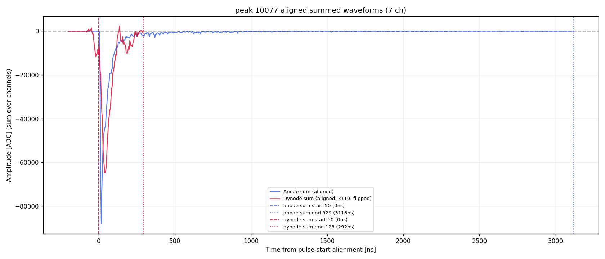

> 放大后 dynode_sum 与 anode_sum 同尺度（高度比 ≈1-3），可直接对比形状。

### sum 对齐一致性验证

**算法**：peak 内各通道 sum 起始点与参考脉冲起始点的差值分布
（`sum_start_delta`），中位 0ns，86.8% 落在 |Δ|≤4ns。

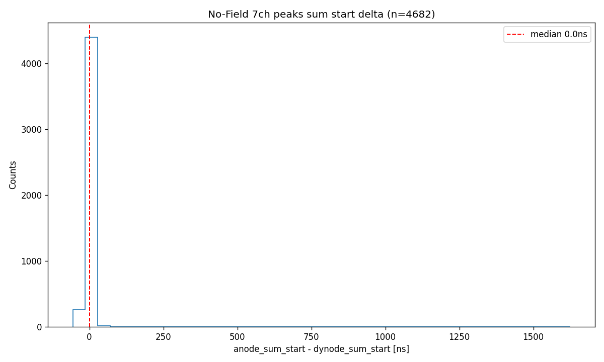

---

## 步骤 6：peak 级参数（sum 波形基准）

**算法**（`compute_peak_features`，**全部由 sum 波形计算**）：

| 参数 | 定义 | 单位 |
|---|---|---|
| `height` | max(anode_sum 高度, dynode_sum 高度) | ADC |
| `width` | anode_sum FWHM ×4 | ns |
| `rise_time` | anode_sum start→peak ×4 | ns |
| `width_ns` | (anode_sum end − anode_sum start) ×4 | ns |
| `width_90area/50area` | anode_sum 含 90%/50% 面积的宽度 ×4 | ns |
| `area_ano`/`area_dyn` | 区间 [anode_sum start, dynode_sum end] 内**原始 ×1** 面积 | raw ADC·samples |
| `anode_area_pe`/`dynode_area_pe` | area_ano/area_dyn × mean-gain PE 标定（无放大） | PE |
| `anode_sum_area`/`dynode_sum_area` | 全波形面积 × PE 标定（dynode 含 ×230） | PE |

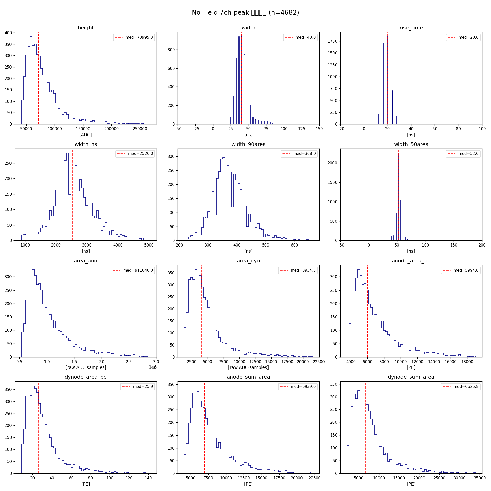

> 统计表见 `muon_peak_screening_results.md`；完整数据：`peak_params_all.csv`。

---

## 步骤 7：面积关系与 anode/dynode 比值

**算法**：`area_ano/area_dyn` 2D 直方图 + 线性拟合。No-Field 实测：

- 中位比值 **≈230**（anode:dynode 原始面积比，稳定）
- PE scale 后比值不变（cal 相消），中位 area_ano ≈7,842 PE、area_dyn ≈33.9 PE
- 自由线性拟合（x≤12000 段）：`y = 147.4·x + 344,774`（R²≈0.965）——截距来自
  area_ano 未减基线的常数偏移

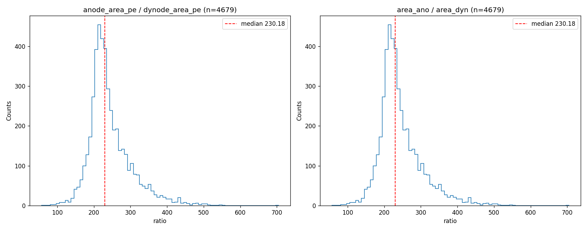

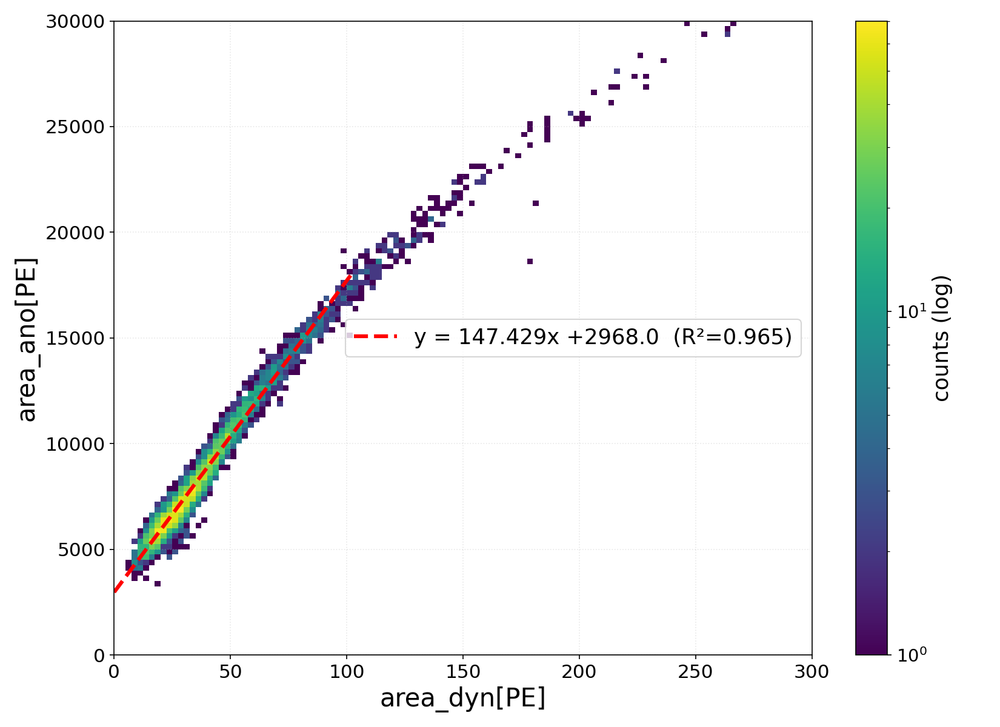

---

## 步骤 8：muon 候选筛选（filtering）

**算法**：peak 级阈值判据（AND 交集）。No-Field 批量筛选（n=4,682 个 7ch peaks）：

| cut | 通过数 |
|---|---|
| `n_channels ≥ 7` | 4,682 |
| `height > 15000` ADC | 4,682 |
| `anode_sum_area > 10000` PE | 879 |
| `width_ns > 5000` ns | 48 |
| **全部满足（AND）** | **48（1.03%）** |

**关键参数**：`filtering.height_min/anode_sum_area_min/width_ns_min`
（写入 `config/analysis.yaml` 时统一为 sum 基准命名）。

**候选事例示例**（anode_sum / dynode_sum 波形，各 run 典型代表）：

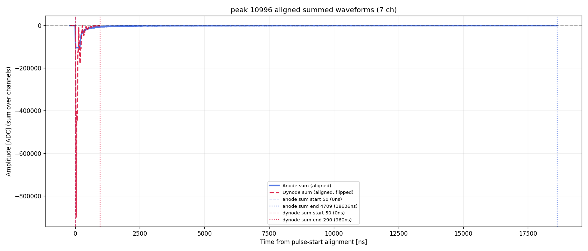

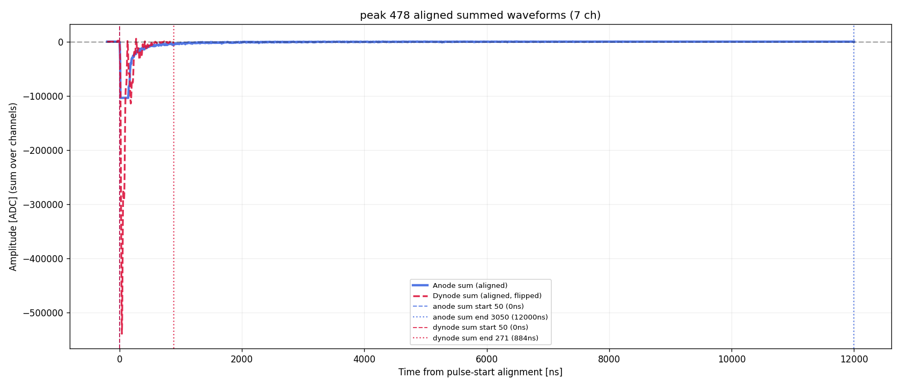

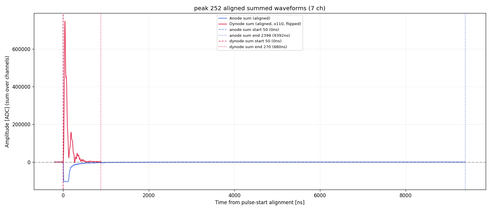

> 48 个候选：run 401→10、402→12、403→15、404→11；height 146k-1.83M ADC、
> anode_sum_area 14.8k-64.9k PE、width_ns 5.1k-18.6k ns。逐事例对比图见
> `selected_48/sum_waveforms/`。

### 48 个 muon 候选的 peak 级参数分布

**筛选条件（AND）**：`n_channels ≥ 7`、`height > 15000` ADC、`anode_sum_area > 10000` PE、`width_ns > 5000` ns

| param | median | q25 | q75 | mean | min | max |
|---|---|---|---|---|---|---|
| height [ADC] | 320,620 | 250,930 | 437,633 | 400,861 | 146,280 | 1,831,260 |
| width [ns] | 92 | 83 | 105 | 98 | 56 | 216 |
| rise_time [ns] | 20 | 16 | 24 | 20 | 12 | 32 |
| width_ns [ns] | 5,700 | 5,399 | 6,653 | 6,586 | 5,040 | 18,636 |
| width_90area [ns] | 742 | 648 | 860 | 815 | 492 | 2,124 |
| width_50area [ns] | 84 | 76 | 93 | 89 | 60 | 208 |
| area_ano | 3,176,828 | 2,801,916 | 3,676,989 | 3,416,885 | 1,985,282 | 7,946,273 |
| area_dyn | 26,278 | 20,049 | 35,099 | 32,146 | 11,189 | 140,068 |
| anode_area_pe [PE] | 20,904 | 18,437 | 24,195 | 22,484 | 13,063 | 52,287 |
| dynode_area_pe [PE] | 173 | 132 | 231 | 212 | 74 | 922 |
| anode_sum_area [PE] | 24,305 | 21,332 | 27,679 | 26,141 | 14,842 | 64,945 |
| dynode_sum_area [PE] | 41,265 | 32,236 | 55,032 | 49,977 | 18,028 | 211,958 |

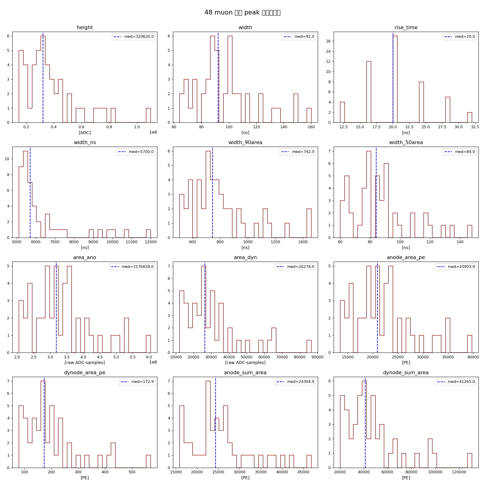

> 与全体 7ch peaks（n=4,682）对比：候选 height 中位 320k（全体 71k）、width_ns 5.7µs（2.5µs）、
> anode_sum_area 24.3k PE（6.9k PE）——候选显著更"高能 + 宽脉冲"。
> 完整逐事例表：`/mnt/data/tmp/muon_analysis/no_field_peaks/selected_48/selected48_params.csv`。

### muon 事例率：实测 vs 理论对比

**实测率（48 个候选）**
```
观测时间 T = run 00401-00405 × 3600s = 18,000 s = 5.0 h
R_meas = 48 / 18000 s = 2.67×10⁻³ s⁻¹ = 0.160 min⁻¹ = 9.6 h⁻¹
```

**理论值（海平面，5cm 直径探测器）**
```
海平面 muon 全角度通量 Φ ≈ 1 cm⁻² min⁻¹ = 167 m⁻² s⁻¹（pμ>1 GeV，向下 2π）
探测器面积 A = πr² = π×(2.5cm)² = 19.6 cm² = 1.96×10⁻³ m²
R_geom = Φ·A = 167 × 1.96×10⁻³ ≈ 0.33 s⁻¹ ≈ 19.6 min⁻¹ ≈ 1,178 h⁻¹
```

**对比**
```
ε = R_meas / R_geom = 2.67×10⁻³ / 0.327 = 0.81%  → 实测比几何期望低 ~123 倍
```

**压低推理（效率链分解，数据驱动）**

| 环节 | 效率 | 说明 |
|---|---|---|
| 7ch 全符合 | 12.5% | 4,682/37,511 全部 peaks 为 7ch——muon 须同时命中全部 7 个 PMT（几何接收度大幅缩小）|
| width_ns > 5µs | 1.03% | 48/4,682 个 7ch peaks——最强制约，只留宽脉冲（掠射/长径迹/多簇）事例 |
| height>15k ∧ anode_sum_area>10k PE | ~100% | 48 个全部通过，不额外淘汰 |
| 总效率（对全部 peaks）| ≈ 12.5% × 1.03% ≈ 0.13% | 与对几何通量的 0.81% 同量级 ✓ |

**推理**：实测率显著低于几何期望的主因是 **7 通道符合的几何接收度**（~10⁻¹）与
**宽脉冲判据**（~10⁻²）的联合压低；能标阈值（高度/面积 PE）在本数据集不额外损失。
两条独立估算路径（对全 peaks 的效率链 0.13% vs 对几何通量的 0.81%）量级一致，交叉验证合理。

---

## 步骤 9：COG 位置与三维径迹（cog/track）

**算法**：PMT pattern 导入 → 按 `charge_per_pmt`（电荷权重，侧由
`cog.charge_source` 选择）计算 COG 重心 `(cog_x, cog_y)` → dynode 1µs 时间切片
三维径迹重建。

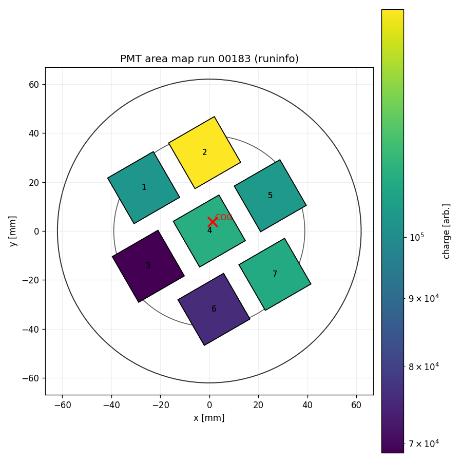

---

## 配置要点汇总（config/analysis.yaml）

| 配置组 | 关键键 | No-Field 值 |
|---|---|---|
| matching | `dynode_shift_ns` / `sample_interval_ns` | 16 / 4 |
| clustering | `window_ns` | 100 |
| plotting | `dynode_scale` / `dynode_lp_cutoff_hz` | **230** / null（硬件 25MHz，无软件低通）|
| filtering | peak 级阈值 | 见步骤 8（sum 基准命名）|
| features | `baseline_samples` / `rise_time_low/high` | 0.1/0.9 |

> 所有 peak 级参数均以 sum 波形为唯一基准；`dynode_scale` 仅作用于
> `dynode_sum`/逐通道 dynode 特征/`dynode_sum_area`，**不作用于**
> `area_ano/area_dyn/anode_area_pe/dynode_area_pe`。
