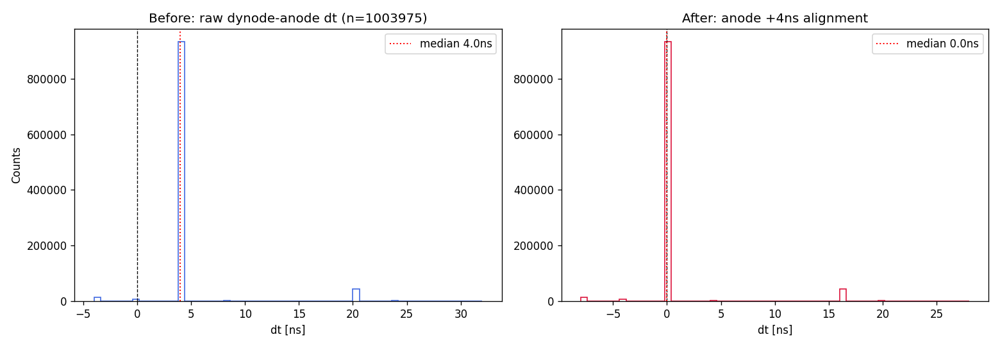
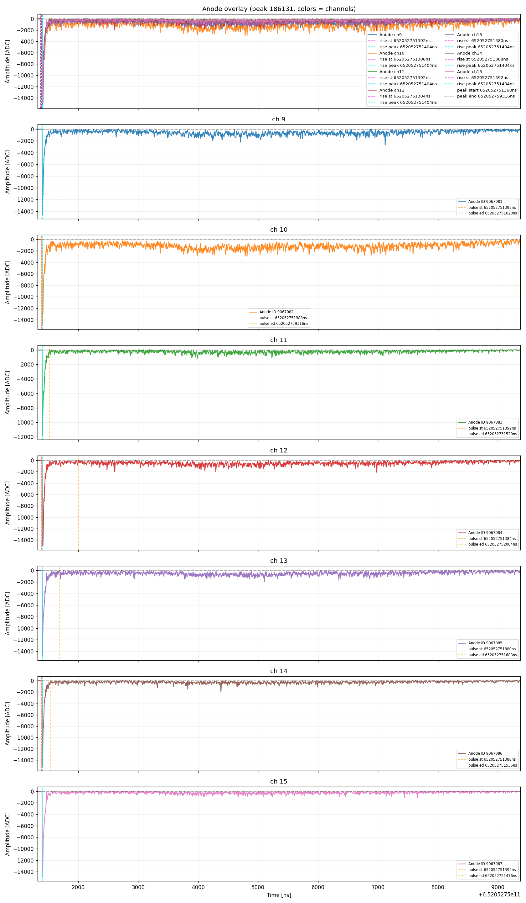
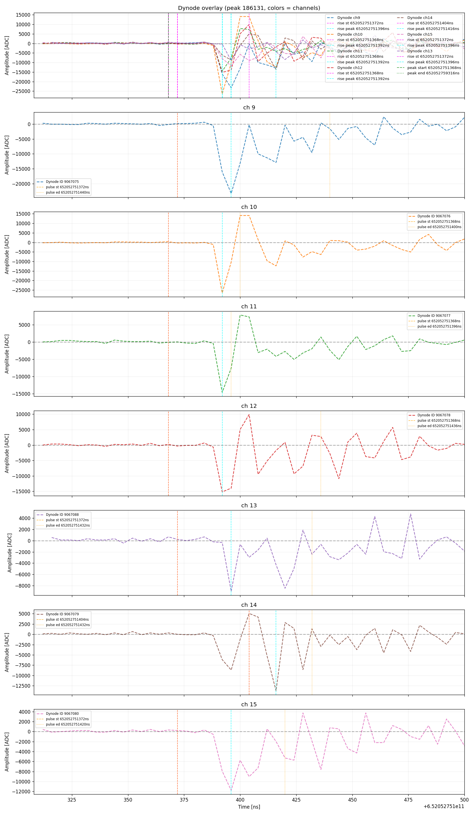
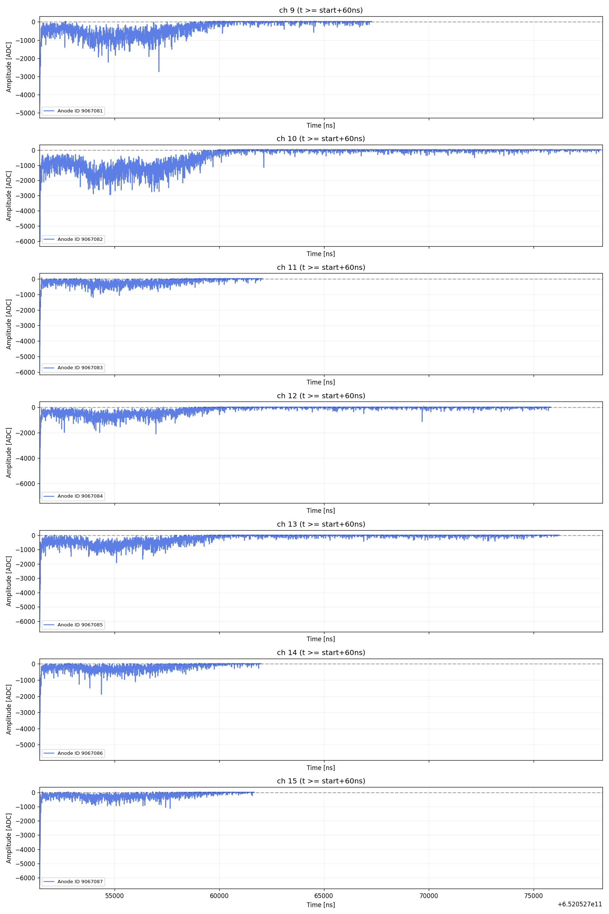
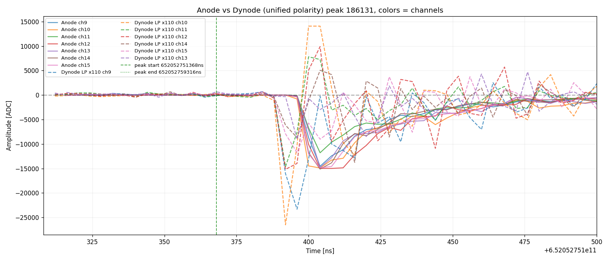
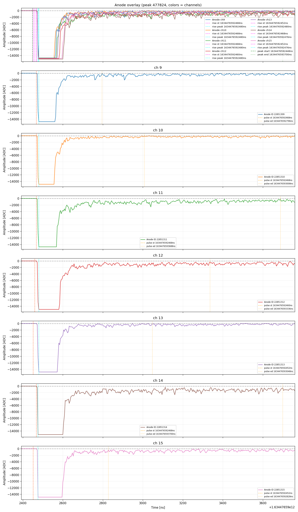

# MuonDAS 分析总结

> Muon 事例筛选、打拿极（dynode）读出分析与径迹重建——方法、架构与验证结果总结。
> 配套：[需求](muon_dynode_analysis_requirements.md) / [实施计划](muon_dynode_analysis_implementation_plan.md) /
> [架构](muon_analysis_architecture.md) / [批量结果](muon_batch_selection_report.md) / [开发进展](muon_development_progress.md)。

---

## 1. 方法概述

**处理流程**（单 run）：

```
read → match → cluster(peaks) → 验证图 → features → filter → COG → track → output
```

| 阶段         | 方法                                                                                                                          |
| ------------ | ----------------------------------------------------------------------------------------------------------------------------- |
| 数据读取     | `waveform_analysis` / npy / hdf5 三后端，按 board 分离 dynode(1)/anode(0)                                                     |
| **时间匹配** | 原始 dynode−anode dt 中位数 ≈ 4 ns → **anode +4 ns 对齐**（等价 dynode 移位）→ 按 channel `merge_asof(backward)`，对齐后 dt≈0 |
| **波形聚类** | record time 100 ns 窗口聚合成 peak（7 PMT 全命中）                                                                            |
| **寻峰**     | 稳健基线（全局中位数）→ argmin → 削顶平台跳过 → 左右边界行走；anode end=首次回基线，dynode end=回基线+3 点稳定确认            |
| 特征         | area/height/rise_time(start→peak)/width/width_90area/width_50area/PE                                                          |
| 筛选         | 7 通道全命中 + 大幅值 + 高电荷 + 长窗口（`n_ch≥7, h>10k, anode_PE>5k, width_ns>5µs`）→ **50 runs 筛出 38 候选**               |
| COG / 径迹   | PMT pattern（runinfo pos / 文件 / 回退）+ 重心法；anode 时间切片逐切片 COG                                                    |

## 2. 架构

```
scripts/run_analysis.py · run_batch.py · sample_data.py · validate_peaks.py
       · export_muon_candidates.py · plot_peak_samples.py · batch_muon_select.py
src/muon_analysis/
  config.py       配置(CLI>用户>默认) + 参数哈希 + YAML 数值规范化
  io/             runinfo / readers / run_index / data(RunData 按 board 分离)
  matching.py     时间匹配(移位+merge_asof)
  clustering.py   100ns 聚类 → Peak(多 anode+dynode)
  pulsefinding.py 寻峰(start/end) + peak 窗口聚合
  features.py     peak 特征(dynode 30MHz LP + ×110) + width_90area/50area
  gain.py/pe_calibration.py   SPE gain 查询 + 电荷→PE
  filtering.py    peak 级 muon 候选筛选
  cog.py          PMT pattern(文件/runinfo pos/回退) + COG 重心
  track.py        dynode/anode 时间切片 + 三维径迹
  plotting/       验证图(叠加/逐通道/对比) + pattern 图 + 统计分布图
  output.py       CSV(peak 级全参数) / npz / PNG / metadata
  pipeline.py     主流程编排 + tqdm + 并行
```

## 3. 关键方法示意图（波形说明）

### 3.1 时间匹配：对齐前后 dt 对比

原始 dynode−anode 时间差（dt）中位数 ≈ **4 ns**（run 00183），对 **anode 施加 +4 ns** 后
dt 中心回到 0，实现高精度时间对齐：



- 左：移位前原始 `dynode_time − anode_time` 分布（中位数 ≈4ns，未对齐）
- 右：**anode +4 ns** 对齐后 dt 分布（中心 ≈0，红色虚线=中位数）

### 3.2 匹配后验证：anode/dynode 波形对



peak 186131 anode 验证图（7 通道叠加 + 逐一，含 start/end/rise 标记线）：
削顶（饱和）脉冲 + 长时间恢复拖尾——长尾型 muon 候选的代表。



对应 dynode 波形（30 MHz 低通 + 反相 ×110）：脉冲主体清晰，7 通道时间对齐良好。

### 3.3 脉冲细节窗口（start+60ns 之后）



将 anode 波形从 `peak.start+60ns` 起绘制，便于核查削顶平台后的恢复/拖尾细节。

## 4. Peak 级筛选与代表性波形

**筛选条件**：`n_channels≥7, peak_height>10000, anode_area_pe>5000 PE, peak_width_ns>5000 ns`，
50 runs 共筛出 **38 个 muon 候选**（详见 [批量筛选报告](muon_batch_selection_report.md)）。

### 4.1 长尾型代表（peak 186131，width≈7.9µs，w90=6.6µs）



anode（蓝）与 dynode（红，×110 反相）极性统一对比：主脉冲对齐，削顶后长拖尾。

### 4.2 高电荷型代表（peak 477824，anode_PE≈22.8k，width≈1.25µs）



大幅值高电荷事例：7 通道强脉冲，能量集中（w90 仅 235 样本），与长尾型形成对比。

### 4.3 COG 位置重建示例（peak 392386）


PMT 面积图：方块=7 个 PMT（电荷着色），红叉=COG 重心位置——结合各通道电荷用重心法
重建事例横向位置。

## 5. 物理结论（run 00183 分析）

- **时间匹配**：dynode +6 ns 移位 + 按通道 merge_asof 后，dt 严格落入 [0,40]ns，匹配可靠。
- **波形特征**：muon 候选的 anode 普遍**大幅值（≈15k ADC，饱和削顶）**，dynode 侧在
  **50 MHz 噪声**影响下信号质量受限。
- **触发阈值得出结论**：由于 dynode 的 **50 MHz 噪声**问题，DAQ **触发阈值被人为拉高**，
  导致 **muon S2 信号未被触发记录**；在已记录的事件中，**S1 部分的波形存在极大的
  震动（振铃/振荡）**，影响脉冲形状类参数的提取精度。
- 尽管如此，7 通道全命中 + 高电荷 + 长窗口的候选仍可从已记录数据中筛出（38 个/50 runs）。

## 6. 下一步工作

- **噪声来源已排查明确**：噪声来自 **DT sensor 的 PID 电路**（非探测器本底）。
- **新 LXe Run 计划**：在新的 LXe 运行中**降低触发阈值**，使 muon S2 信号能够被记录，
  继续本验证研究（完整 muon 事例的 S1+S2 关联、径迹重建与位置分析）。
- 代码侧：对 38 个候选做逐事例波形验证、径迹重建、COG 位置分布；阈值固化后批量复跑。

---

_生成：2026-08-24 · MuonDAS_
