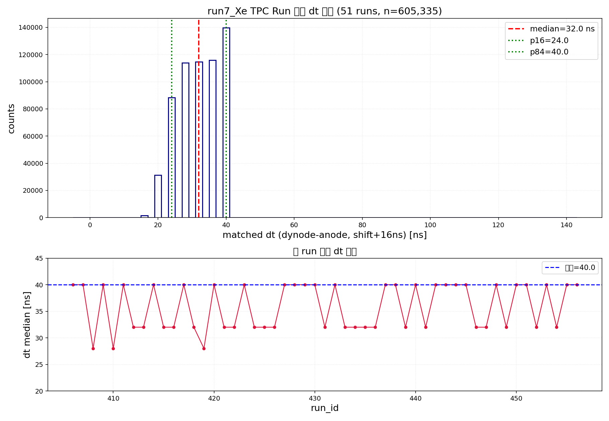

# run7_Xe TPC Run 匹配与聚类分析（处理进展）

> 数据源：`docs/run7_xe_tpc_run.csv`（run 00406-00498，93 个 run，"After liquid level adjust, ano 50adc, dyn 15adc"）
> 处理：**read → match（配对）→ cluster（peaks），不做 muon 候选筛选**
> 配置：沿用 No-Field 参数（`dynode_shift_ns=16`、dt 窗口 `[0,40]`）
> 状态：**完成 51/93 run（00406-00456）后暂停**（后台任务已在 tmux 会话中断）

## 一、处理规模（51 run）

| 指标 | 值 |
|---|---|
| 已完成 run | **51 / 93**（00406-00456）|
| 匹配对（配对）| **605,335** |
| peaks（聚类）| **269,239** |
| peaks/匹配比 | 0.445 |

## 二、dt 分布

**合并 dt（n=605,335）**：中位 = **32.0 ns**，p16 = 24 ns，p84 = 40 ns，范围 [0, 40]



**逐 run dt 中位**：28-40 ns（多数 run = 40，部分 28/32）——详见
`/mnt/data/tmp/muon_analysis/tpc_run7_xe/tpc_run7_xe_matched_summary.csv`

## 三、关键问题

这批 TPC run（液面调整后）匹配 dt 集中在 **窗口上界 [0,40]（中位 32-40ns）**，
与 No-Field 显示 dt（中位 ~16ns）明显不同：

- **当前 `dynode_shift_ns = 16`（来自 No-Field）对这批 run 偏小**，真实配对被
  挤压在 `max_diff_ns = 40` 边界，存在截断/丢弃风险。
- **原始 dt 分 run 交替为 16 / 32 ns**（如 00408/00410/00419 = 16，其余 = 32），
  与 No-Field（恒 16ns）不一致——需重新标定本批 run 的 `dynode_shift_ns` 或放宽窗口。

## 四、输出位置

```
/mnt/data/tmp/muon_analysis/tpc_run7_xe/
├── progress.log                          # 逐 run 进度（n_matched/n_peaks/dt_med）
├── {run_id}_matched_dt.npy               # 逐 run 匹配 dt（51 个）
├── all_matched_dt.npy                    # 合并 605,335 dt
├── tpc_run7_xe_matched_summary.csv       # 51 run 匹配+peak 汇总
└── tpc_run7_xe_matched_dt_histogram.png  # dt 分布 + 逐 run dt 中位
```

## 五、后续可选项

1. **重新标定 TPC run 的 `dynode_shift_ns`**（基于原始 dt 16/32ns 或实测硬件延迟），
   避免窗口截断，重跑匹配。
2. 或**放宽 `max_diff_ns`** 窗口（如到 64ns）再匹配。
3. 补齐剩余 42 个 run（00457-00498）后合并全量 dt 分布。

> 注：本进展基于 **51 个已完成 run**；剩余 run 未处理。
